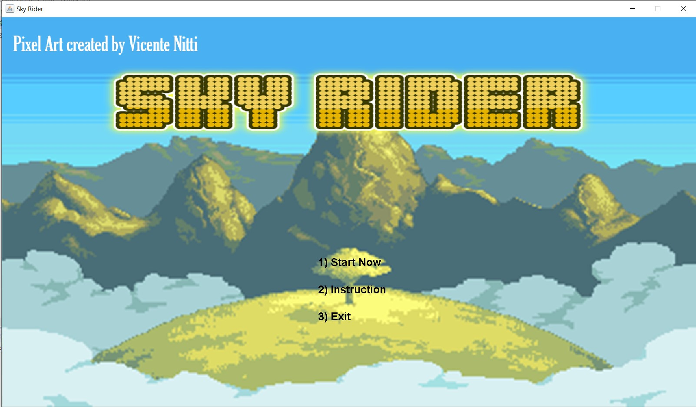
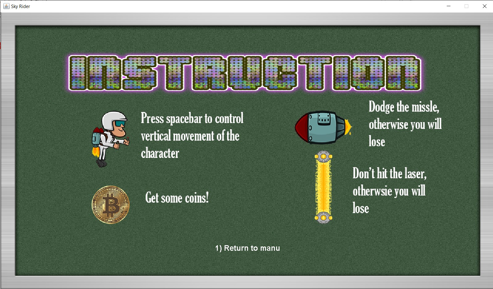
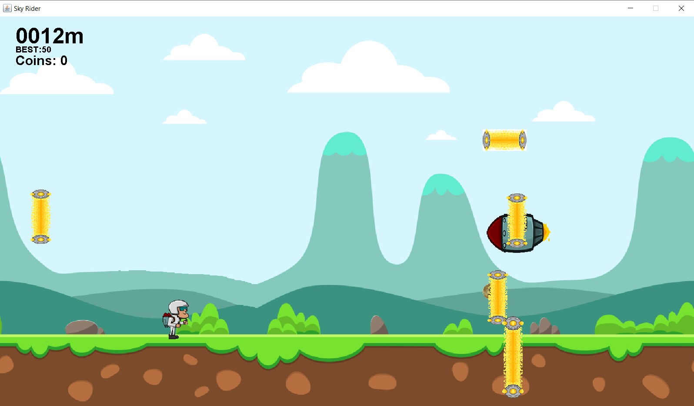
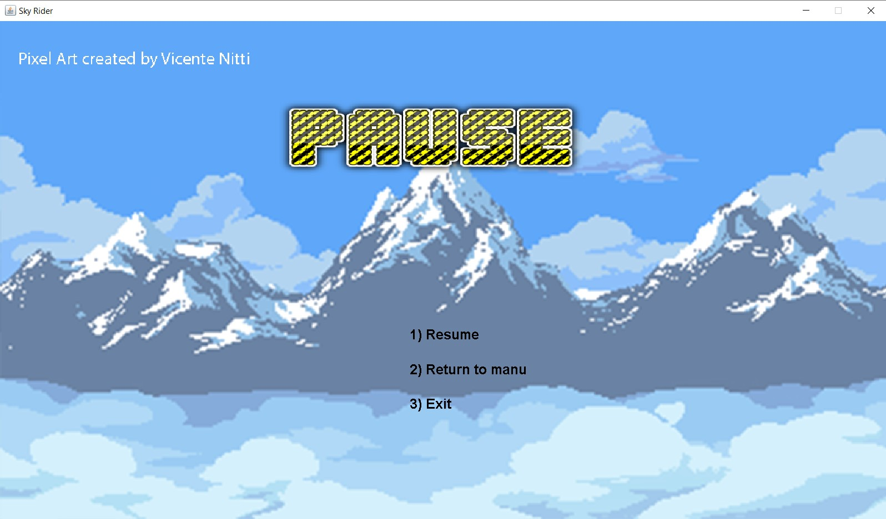
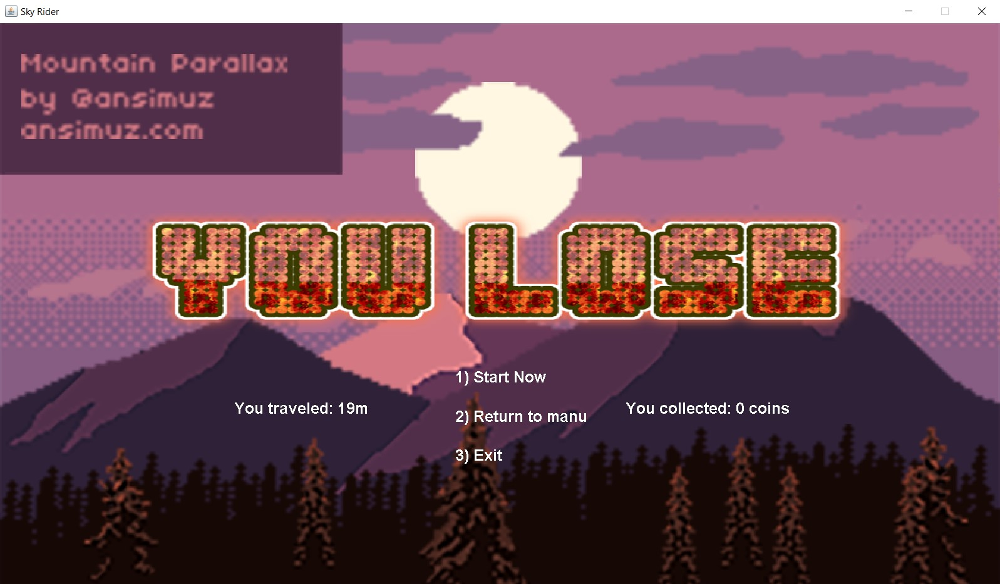

# Sky Rider Game
Sky Rider Game is a Java graphic game that was developed from a Space Invaders game built by my programming teacher. It means to challenge players to dodge all obstacles to beat the highest score.

My team of three developers was addicted to the Jetpack Joyride game. We were inspired to develop a similar game but in our version when we were in high school. 

**Download this game (2018-2019 -> SkyRider)**: [https://mdinfotech.net/examples/Computer%20Science%2012/Games/](https://mdinfotech.net/examples/Computer%20Science%2012/Games/) 

## How does Sky Rider game work?
1. Call a game loop to draw a home page
2. Press 1 to change game state to "gameMode" to start the game
3. Repeat the game loop to draw a character, background and obstacles
4. Press the up/down arrow to vertically control a character
5. Apply the gravity to the character
6. Generate random obstacles and bonus coins on the screen moving horizontally toward the character
7. Repeat the game loop to update character's and obstacles' positions every millisecond
8. Change game mode to "loseMode", draw a score and reset the game if a collision is detected

## Key skills
* Java
* Java OOP
* Java Canvas
* Teamwork!

## What is missing
This is the first programming project that I worked in a team to complete. In the end, some components can be improved.
1. Calculate a position to generate obstacles to avoid overlapping
2. Set a limit acceleration for the obstacles
3. Avoid generating too many obstacles on the screen
4. Make a moving graphic for the character

## Example of HomePage, Instruction, gameMode, pauseMode and LoseMode

### Home Page

### Instruction

### Game Mode

### Pause Mode

### Lose Mode

    
